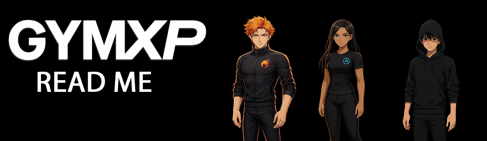
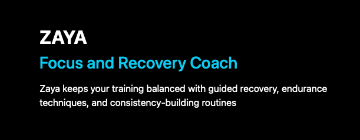
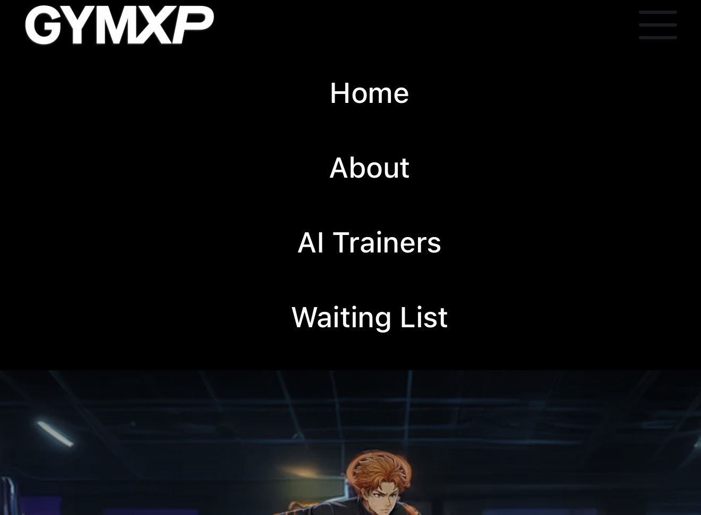
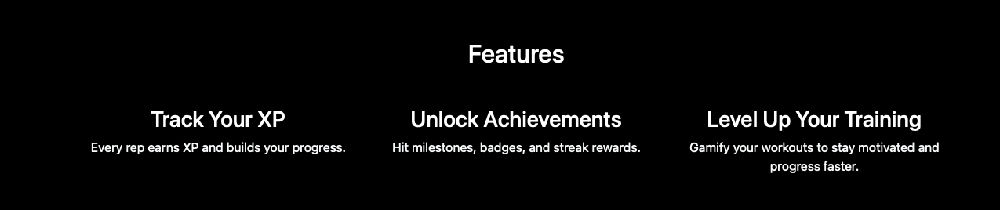
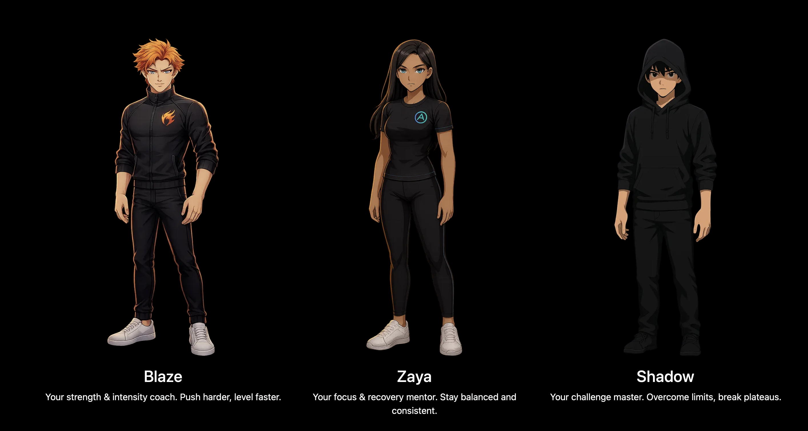
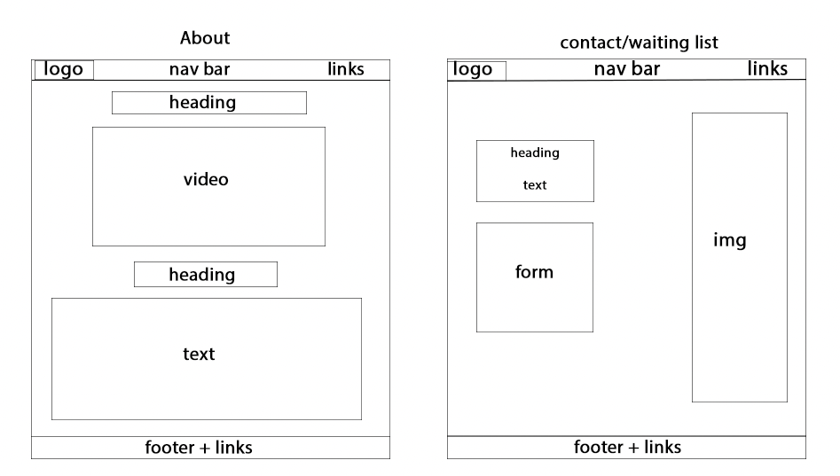

 

  <a href="https://bankaiogx.github.io/website/" target="_blank">
    🔗 <strong>Click here to view the live GYMXP website</strong>
  </a>

# GYMXP — Gamified Fitness
## Table of Contents
- [Overview](#overview)
- [Purpose](#purpose)
- [Target Audience](#target-audience)
- [UX / UI Rationale](#ux--ui-rationale)
- [Page Breakdown](#page-breakdown)
- [Accessibility Features](#accessibility-features)
- [Responsive Design](#responsive-design)
- [External Code Attribution](#external-code-attribution)
- [Testing](#testing)
- [Bugs and Fixes](#bugs-and-fixes)
- [Version Control](#version-control)
- [Deployment](#deployment)
- [Future Improvements](#future-improvements)
- [Screenshots](#screenshots)
- [References](#references)

---

## Overview

GYMXP is a gamified fitness platform designed as a user-centered web application. It transforms traditional workouts into an engaging, interactive experience using XP progression, AI-powered virtual trainers, aura effects, achievements, and motivational behaviour-design principles.

The project demonstrates strong UX/UI decision-making, accessibility-focused design, optimised front-end performance, and a structured development workflow. By merging fitness with game-style progression systems, GYMXP aims to increase user motivation, consistency, and long-term engagement through clear goals, instant feedback, and visual reward mechanics.

Inspired by successful behaviour-driven apps like Duolingo, GYMXP targets a niche gap in the ever growing fitness market aswell as utilising the gamification trend by combining core gamification elements, AI, and gym-based training in a modern, aesthetically focused interface. The website acts a pre-launch platform and showcases the app concept through cinematic visuals, interactive avatars, and clear feature explanations providing users with a compelling preview of the full GYMXP experience. This experience, in turn, has the real prospect to attract users and potential investors interested in bringing the product to the market.
## Purpose

The purpose of this website is to clearly introduce the concept of GYMXP in a way that is simple, visual and easy for users to understand. The site acts as a gateway to information that showcases the key features of the concept, such as XP progression, the AI trainers (which are the key USP), and the overall design and theme of the app. Each page has been designed to visually engage visitors in a style similar to how professional companies and studios present their concepts. The images, videos and text have been arranged in a way that is easy for users to follow and understand without overwhelming them with too much information at once.

From a development perspective, the website is designed to demonstrate my ability to build a responsive, accessible and user‑centred front‑end project. It highlights the use of clean HTML structure, optimised images for efficient performance, Bootstrap for layout, and a consistent visual UI that fits the vision of the project while meeting best practices and accessibility standards. The main purpose of this project, within the scope of development, is to showcase my ability to design and implement a fully responsive interface using HTML5, CSS and Bootstrap.
## Target Audience

The target audience for this website are users who are interested in fitness, self‑improvement and gamified experiences. The typical age range for this demographic is between 15–35. The GYMXP website is mainly aimed at people who struggle with motivation, enjoy strong visuals and visual progress, and prefer more interactive and rewarding modes of training. This includes beginners who want structure, guidance and discipline, as well as more experienced gym users who want to track their progress in a more engaging way than traditional fitness apps currently offer.

The project is also aimed at users who respond well to visual stimuli and character driven design. The three core AI coaches—Blaze, Zaya and Shadow appeal to users who enjoy personality, narrative and digital guidance. The XP system further supports this by mirroring the type of progress users are familiar with from gaming environments. The website presents all of this information in a clear, fun and visually engaging way, with the aim of encouraging users to join the ‘Waiting List’ for early access.

Additionally, the website helps communicate the GYMXP concept to stakeholders and potential developers by clearly presenting the visuals, layout and key features of the idea.
## UX / UI Rationale

The design of the GYMXP website is based on a user‑centric approach that focuses on clarity, visual engagement and simplicity. These three core aspects guided the project from the very beginning with the aim of providing users with a user‑friendly, engaging and easy‑to‑navigate experience. The layout across the entire website was intentionally kept clean, with strong spacing, clear headings and well-structured sections to ensure users can move through the site without confusion or information overload.

Dark backgrounds combined with bright accents and coloured text were chosen to complement and match the energetic, anime‑inspired theme of the project. All of these visuals were implemented while still maintaining readability and accessibility. The use of large visuals, bold typography and subtle animated imagery reflects the core concept behind the website and the product itself, helping to emphasise personality and aesthetic identity.

  

<em>Visual in AI Trainers page showcasing the visual and anime‑inspired brand identity and how it it fits with the theme of the page and navigation.</em>

Each page of the website has been designed to highlight one idea at a time. For example, the AI Trainers page focuses on showcasing the three coaches, the Waiting List page provides a clear and simple form for users to register interest, and the About page uses a video supported by text to explain the core app concept. This approach was deliberately chosen to simplify navigation and prevent cognitive overload, allowing users to absorb information at their own pace. The flow of media and text avoids clutter and ensures the overall experience remains accessible and easy to use.

The targeted demographic (ages 15–35) was also considered throughout the design process. Users in this age group typically prefer fast, visual and straightforward interfaces, so the structure, visuals and pacing of information delivery were designed to match these expectations. This design caters specifically to those users while still being friendly for others. Users also tend to skim through websites rather than fully read all the content, so the UX/UI was created with this behaviour in mind—keeping it simple yet aesthetically pleasing, with clear headers and sections laid out in a way that avoids clutter.
<table>
  <tr>
    <td align="center">
       on trainers page">
       
      <em>Example of header</em>
    </td>
    <td align="center">
       elements and 
 element.">
       
      <em>Example of spacing between <H> and 
 elements</em>
    </td>
  </tr>
</table>

The navigation bar was intentionally kept clean and thin to provide more of an aesthetic and modern sleek look. This was placed at the top of each page as most websites improving usability. The GYMXP logo also doubles as a home button which follows best practice and improves flow for the user. On mobile screens, the navigation collapses into Bootstrap’s hamburger menu. This keeps the layout clean and prevents the navigation links from overcrowding the screen. By collapsing the links into a menu, it avoids clutter and allows the logo and design elements to remain visually balanced. This mobile adaptive behaviour ensures the navigation is kept simple and easy to use.
<table>
  <tr>
    <td align="center">
      
       
      <em>Desktop navigation bar</em>
    </td>
    <td align="center">
      
       
      <em>Mobile hamburger navigation bar</em>
    </td>
  </tr>
</table>
The use of Bootstrap classes was chosen to handle majority of the spacing and layout. this was achieved by implementing the Bootstrap responsive grid system to ensure a consistent and clean layout. It kept spacing and layout balanced across all pages and prevented elements from appearing unbalanced or shifted. The Bootstrap framework also allowed the website to scale appropriately on mobile, desktop and tablet without the need for extra code. Using Bootstrap allowed faster development without compromising on a high design standard. Ultimately, Bootstrap helped achieve a polished and aesthetic design that aligned with the core concepts of clarity, visual engagement and simplicity. In addition to Bootstrap's grid system, custom CSS media queries were used to adjust spacing, typography and image sizing. This ensured the layout scaled appropriately on different types of devices thus demonstrating the use of an advanced technique.
<table>
  <tr>
    <td align="center">
      
       
      <em>Bootstrap grid system example for text</em>
    </td>
    <td align="center">
      
       
      <em>Bootstrap grid system example for images </em>
    </td>
  </tr>
</table>

The design implements three well known established UX laws to support clear interaction.Hick’s Law was implemented as the the use of simple layouts and minimal options per page, which i have applied, reduces user decision time in theory. Fitts’s Law has also been applied through the use of large and easy to tap buttons and links especially with the hamburger menu on mobile devices. Lastly Cognitive Load was implemented through the strategic design of breaking information into smaller sections with spacing and a clear hierarchy, preventing cognitive overload. With all this, no UX rules were deliberately broken and my design choice and features ensures a smooth user experience.

### Wireframe

Below are wireframe diagrams used to guide the design and layout of the website.
  <table> 
    <tr>
     <td align="center">
       
        
       <em>Wireframe diagram for Home and Trainers pages</em>
     </td>
     <td align="center">
       
       
       <em>Wireframe diagram for About and Waiting List pages</em>
     </td>
  </table>

## Page Breakdown

### Home Page

The Home Page serves its purpose as the landing page and main introduction to the GYMXP Concept. It is designed to communicate the core idea of the platform. The hero section of the home page features a cinematic fullscreen background taking up the width of the page, with a bold headliner, subheader and a charcter animation to the right. The background image has had a fade applied to it from the bottom so it blends in well with the complimenting black background. This dynamic design was intended to set the visual identity and tone for the rest of the project.

The structure of text was intentionally designed to allow visitors to understand the purpose of the app quickly. The brand message ("Transform your workout into XP") is reinforced visually through the use of strong and bold typography and text underneath. Two buttons ('Register Interest' and 'LEARN MORE') are positioned directly below the hero text with sufficient spacing to maintain clarity. This spacing creates a more balanced, aesthetic layout and prevents the text and buttons from appearing cluttered, while still allowing the background image to remain clearly visible and unobstructed. The buttons also follow Fitts’s Law by using high-contrast colours, large tap-friendly sizing and clear labelling to improve usability and accessibility.

Below the her section, three key features are displayed in bootstrap three column layout ('Track your XP', 'Unlock Achievments', Level Up On Your Training'). This design uses minimal text, clear spacing and short and concise desciptions to prevent cognotive overload, helping the visitor to quickly understand the three core aspects of the product. Each feature follows a consistent design, spacing, maintaining readability across various different screen sizes.

A preview of the three AI trainers is included below the features section. This Avatar section introduces three familiar faces users will see across the site - Blaze, Zaya and Shadow. These are the main characters of the app/product. This section is intended to highlight the personality driven aspect of the GYMXP concept. The layout, once again borrowed from Bootstrap, centres the avatars visually and uses spacing thus helping the section feel connected and consistent with the rest of the page and grid system.

To enhance user experience, the Home page makes the subtle use of  UI enhancements such as fade-in animations on text, images and videos as well as smooth hover interactions on the AI avatar previews. This includes  a zoom in effect as well as a character attributed glow to each avatar image to highlight and support the visual and character driven aesthetic of the GYMXP concept.

The Home Page layout adopted the use of Bootstrap's responsive grid system, allowing it smoothly adapt to different screen dimensions. For example, the hero section's two column layout transforms to a single column on mobile and this ensures the hero text and video remain readable. The three column features section as well as the AI avatar previews stack on top of each other on mobile devices, preventing clutter and maintaining readability and clarity. Utilities such as img-fluid, mx-auto and text-md-start were used to maintain spacing and alignment that is consistent no matter the device.

Accessibility was implemented in the design of the Home Page through the use of Alt text on images, ARIA labels on the navigation bar and the use of high contrast buttons that meet expected readability standards. Buttons use high contrast and large sizing to support both mouse and touch input.

### About Page

The About page provides a clear explaination of the GYMXP concept using a simple and structured layout. The page opens with a bold header and a short description immediately introducing the the purpose of the app. Below this is an animated video of one of the AI trainers - Zaya and is placed centrally on the page. The design choice to include a video helps reinforce the brand identity and persoanlity driven concept of GYMXP whilst giving visitors a more of a dynamic and engaging means to understand key information.

The layout utilisies Bootstrap's grid system to centre the video and text whilst maintain strong spacing in aim to avoid clutter. The decision to keep the page minimal was an intended choice to over cognotive overload and not distract the user from the key information within the video and supported text. Beneath the video, a short explanatory paragraph highlights the core aspects, such as XP progression, AI coaching and other features that the GYMXP concept has to offer.

Fade-in animations are used subtly to introduce the video and text in order to keep it consistent with the Home Page.

Accessibility was implemented with the use of Alt text for the video element, a readable colour contract (White on Black) and a logical heading structure  to support users with assisstive technologies. The video is muted by default to prevent unexpected audio playback which in turn supports best practise for accessibility and comfort.

The About page presents the concept of GYMXP in a way that is simple, visual and easy to navigate whilst reinforcing the brand identity and character driven idealogy.

### AI Trainers Page

The AI Trainers Page is designed to introduce the three main AI virtual coaches of the GYMXP concept - Blaze, Zaya and Shadow. These three characters form the personality driven core of the concept and represent different training styles, visual identities and motivational tones. The page opens with a cinematic large banner featuring all three AI coaches together reinforcing the anime inspired brand identity as well as settting the undertone for the rest of the contents of the page.

Each trainer is layed out in their own dedicated section through the use of a two column responsive Bootstrap grid. With the portrait image of each trainer being placed on one side whilst the short and descriptive text placed on the other, this aids to create a strong visual structure, ensuring users can clearly distinguish each character and gain a grasp of their unique roles within GYMXP. Consisten and clean spacing, readable typography and balanced image size, mirroring the other, avoid visual clutter and make the page easier to naturally scan for users.

Fade-in animations were once again applied to introduce the entire page which kept it consistent to to use of the same animation in other pages. All images on this page uses WebP, which is an optimised image format to improve performance, which is important especially on this page as this contained larged visuals.

The same concept from other pages were once again displayed in this page as the information has been kept short and focused yet informative, to avoid cognitive overload. Each trainer desciption displays only the essentials traits and their role within the system. this allows users to easily understand the prupose of the trainer system without being overwhelmed by unnecessary information.

Accessibility was considered thoughout this page. all images including Alt text, colour contrast (white  on black) was the primary choice for text colour, and the heading structure is consistent. They layout collpases smoothly on mobile devices with content stacking on top of each other to ensure content remains clear and readable.

Overall the AI trainers page reinforces the persoanlity driven and visual identity of GYMXP, presenting each AI trainer in a focused manner whilst preserving a well structured layout that is simple for users to follow.
### Waiting List Page

TThe Waiting List Page is designed to provide users with a simple and accessible way to register their interest in the GYMXP concept ahead of launch. This page implements a clean and focused layout, with the form placed on the left and a supporting visual banner on the right. This structure is once again achieved through the use of the Bootstrap two-column grid, keeping the page visually balanced while ensuring the form remains the primary focus.

The form itself is intentionally kept minimal to avoid overwhelming the user. Only essential fields are included (Full Name and Email) to streamline the process and make it as easy to complete as possible. Clear labels, strong spacing and large input fields improve readability and ease of interaction for the user, especially on mobile devices. A large and high-contrast submit button supports accessibility and implements Fitts’s Law by making it easy to click or tap.

The supporting image on the right reinforces the visual and brand identity of the GYMXP concept while providing additional personality without distracting from the form. On mobile, the layout collapses vertically, with the text and form appearing first followed by the image banner. This ensures the form — being the main focus — remains easy to complete on smaller screens and maintains usability across different devices.

Subtle fade-in animations were once again applied to the form and the supporting visual to maintain consistency with the rest of the site. The banner visual on this page uses WebP, which is an optimised image format that improves performance.

Accessibility was also implemented thoroughly on this page. All fields include labels, colour contrast remains high, and form controls are large enough to be used comfortably on mobile devices. The page also includes Alt text for supporting visuals and maintains a logical heading structure consistent with the rest of the site.

Overall, the Waiting List Page provides a straightforward and user-friendly experience with a focus on clarity and accessibility, allowing interested users to register their interest without unnecessary complexity or clutter.

## Accessibility Features

Acessibility was an important focuc throughout the entire design and implementation of the project to ensure the design is useable and readable for everyone. s number of accessibility practices were put in place across all pages such as:
- Alt text on all images.
Ever image such as trainer portraits, banners logos and graphics included descriptive alt text so users with screen readers understand the visual content.
- Logical heading structure
Heading levels were corrected and structured correctly on all pages. this improved navigation for users who rely on screen reading technologies.
- ARIA Labels on the Navigation bar
The navigation bar used clear aria-label attributes, especially on hamburger mnu, to help users with assistive technology.
- High contrast text
The entire sites use a white-on-black colour cheme with high contrast buttons. This improves readability for all users, especialy those of low vision or colour blindness.
- Large tap friendly buttons
Buttons such as 'Register Interest' or 'Learn more' use large sizing, generous padding, high contrast that follows best practice inline with the principals derived from Fitt's Law.
- Minimal cognitive load
Information is seperated into small sections with strong spacing, clear headers and content that is structured well. This prevents users from feeling overwhelmed from information overload.
- Muted audio on videos 
Videos autoplay without sound and avoids sudden and unexpected audio for the user. This also follows good practice for accessibility.
- Responsive layout
The layout prevents horizontal scrolling and scales correctly on mobile and other devices.

Overall, the GYMXP website applies a range of accessibility focused implementations, ensuring the interface is usable, readable and supportive for different users across devices and assistive technologies.

## Responsive Design

Responsive design was a core aspect within the design of the GYMXP website to make sure it works smoothly across desktop, mobile and tablet devices. the layout was made keeping mobile in mind as well as well ask desktop using Bootstrap's responsive grid system as well as a few other CSS media queries.

Bootstrap's grid system (container, row, cold-md) was used across all masin sections such as the hero sections, the three features, the AI trainer layout and the waiting list form. On larger screens, such as desktop or large tablets, these are displayed in multiple columns for example the hero text on the left and the media/image on the right whilst on mobile they stack vertically. This maintained readibility without magnifying/pinch to zoom or horizontal scrolling.

Classes such as im-fluid, w-100, text-center, text-md-start, mac-auto and spacing classes like mt-4, mb-5 and py-5 were often used to maintain consistent aligntment and spacing on different devices. Images automatically resize whilst keeping their proprortions and buttons also reposition to a centra position on smaller screens.

CSS media enquiries were also used where Bootstrap wasn't sufficient enough. These were mainly added to fix mobile issues such as the hero video shifting too far to the right or spacing became too tight. after implementing thesde media enquiries in CSS, th hero sections becomes a single column with the text content appearing above the video to keep the flow of information readable and easy to follow.

The navigation bar is fully responsive oo. On desktop the links are displayed on the right and the GYMXP logo, which also served as home button folowing best practice, on the far left. On mobile the navigation collapses into Bootstrap's hamburger menu. This ensured that the header is clean and spacing was suffucient enough as well to avoid a cluttered naviagtion bar. 

Responsive behaviour was tested using Chrome Devtools device emulation as well as testing directly on my own multiple devices and browsers. This confirmed that text is readable, images scaled correctly and buttons were eay to find and tap and there is no horizontal scrolling on any page. 

## External Code Attribution

A number of external resources were used in this project to implement layout structure and interactive behaviour:

- **Bootstrap 5.3** was used for the responsive grid system, spacing, navigation bar and overall page layout.  
  Source: https://getbootstrap.com

- **Bootstrap JavaScript** provides the functionality for the mobile hamburger navigation toggle.

- **CSS animation** utilised for fade-in effects were inspired by common examples on **MDN Web Docs**.  
  Source: https://developer.mozilla.org

## Testing

## Bugs and Fixes
During development, several issues were identified through manual testing, Lighthouse checks,responsive checks using Chrome DevTools and deployment troubleshooting. Below are the key bugs encountered and how each one was resolved. 

### **Bug 1 — Horizontal Scrolling on Mobile (Index Page)**
**Issue:** The homepage could be swiped left and right on mobile screens.  
**Cause:** An invalid CSS selector and incorrect video margins caused layout overflow.  
**Fix:** Removed the invalid CSS, corrected hero video styles and added @media queries so the layout fits the viewport correctly.

### **Bug 2 — Navbar Logo Misalignment (Desktop & Mobile)**
**Issue:** The GYMXP logo appeared too high or too close to the edge.  
**Cause:** Duplicate .container elements and conflicting margin and padding rules.  
**Fix:** Removed duplicate containers and rewrote spacing rules to align the logo across all screen sizes.

### **Bug 3 — Trainer Images Different Sizes**
**Issue:** Blaze, Zaya and Shadow appeared uneven in size visually.  
**Cause:** PNGs had inconsistent dimensions and aspect ratios.  
**Fix:** edited images in Photoshop, resized them to be as close in ehight and re-exported them as WebP for optimisation and consistency.

### **Bug 4 — Slow Loading Due to Large PNG Images**
**Issue:** Lighthouse flagged large network payloads that slowed down performance.  
**Cause:** Trainer PNG files were too large 
**Fix:** Converted all character and banner images to WebP format, reducing file size significantly.

### **Bug 5 — Hero Video Misaligned on Mobile**
**Issue:** On small screens, the hero video overflowed and appeared pushed to the right.  
**Cause:** Desktop margins were applied to mobile layouts.  
**Fix:** Added a mobile media query to reset margins and force the video to full width using max-width property and set to 100%.

### **Bug 6 — Image and Video Paths Broken After Deployment**
**Issue:** Images and videos did not load on GitHub Pages.  
**Cause:** Case-sensitive naming (e.g. Blaze.webp vs blaze.webp) and mismatched folder paths.  
**Fix:** Standardised all filenames to lowercase and updated all HTML references.

### **Bug 7 — Incorrect Heading Hierarchy (Accessibility)**
**Issue:** Lighthouse reported errors where heading levels were not in logical order (e.g., h4 used before h2).  
**Cause:** Headings were chosen for visual styling incorrectly.  
**Fix:** Corrected heading structure across all pages while using Bootstrap classes to maintain visual styling.

### **Bug 8 — Video Controls Not Clickable**
**Issue:** Video controls appeared but did not respond to interaction.  
**Cause:** The video was overlapped by other elements due to incorrect z-index and autoplay attributes.  
**Fix:** Adjusted stacking context and removed conflicting attributes so controls function normally.

### **Bug 9 — Social Icons Too Small to Tap on Mobile**
**Issue:** Touch targets for social links were too small on the Waiting List page.  
**Cause:** Links used default spacing with no padding nor styling in CSS  
**Fix:** Increased padding, spacing and applied the .social-links class to meet tap-target guidelines.

### **Bug 10 —  Safari Glow Revealing Avatar Edges**
**Issue:** On Safari (macOS only), avatars with glow effects displayed visible hard edges or outlines around the character, revealing the original cut-out shape. This did not occur in Chrome or Edge.  
**Cause:** Research on this suggests Safari's engine handles CSS glow effects different than Chromium browsers.
**Fix:** No fix. Was unable to find a fix as it is a broswer specific issue due to their specific rendering limitations.

### **Bug 11 —  GitHub Repository Corrupted (503 Error & Lost Git History)**
**Issue:** Oe project suddenly stopped being recognised as a Git repository. VS Code reported that the folder no longer contained a .git directory, and GitHub returned errors such as 503: Internal Server Error and “fatal: Could not read from remote repository”, blocking all Git commits.  
**Cause:**  Temporary GitHub outage caused failed authentication attempts.As a result, the project could no longer pull, push or fetch, and the remote repo became corrupted.
**Fix:** After exhuasting all options including SSH keys and attempting to clone and force push, I created a new repoand repushed the full project. This restored version control and normal deployment behaviour however losing 130± commits (which are still viewable on the previous Git repo).

## Version Control

Version control was used throughout the development of this project to make and manage changes, track progress and maintain an organisedworkflow. Git and Github were used together, with VS Code as the  development enviroment. This allowed me to cmmit regularly and push updates to the repository.

I followed a simple but effective workflow by writing a feature or fix a bug, test it locally and then commit with a clear message describing descibing the change. This helped maintain and keep the project and keep the project organised as well as making it easier to revert or adjust specific changes when necassary. Changes and updates were commited regularly when necassary and were especially helpful when debugging, for example issues related to layout since i could easily review what caused a change in behaviour.

Github pages were used for deployment, which meant the project was automatically hosted oline each time a change was pushed to the repo. This allowed for quick testing across different devices.

during development of the project, I encountered a significant issue where the original repository became corrupted. the git folder stopped being recognised by VS Code and the repository was returning errors such as 503 and fatal: could not read from remote repository. The project could no longer pull, push or fetch from Github. After trying several solutions, including resetting remotes, attempting to clone via SSH and re-initialising Git however the only fix was to create a new Github repository and repush the project from scratch.

Although this meant losing over 130 commits from the original repository the history is still viewable on the previous repo for reference. Development then continued as normal on the new repository with frequent and consistent commit messages thus restoring a stable workflow and ensuring version control was properly maintained for the remainder of the project.

Version control played an important role in this project not only for tracking changes but also for debugging and recovering from unexpected issues, demonstrating a professional approach to managing a real development workflow.
## Deployment

The deployment wasn handled by Github using Pages. Github provides a free static hosting and automatically updates the live site whenever chages were commited and pushed to the main repository. 

To deploy the project, I first ensured the repository was public then went into Github settings - Pages and selected the main branch as the source. After this, the site generated and was hosted on the Github URL. Any further updates were done simply by committing and pushing changes to GitHub which automatically updated redeployment.

Overall, GitHub Pages provided a straightforward means of deployment and made it easy to test the site on real devices throughout deployment. The final website is fully hosted by GitHub Pages and easily accessible.
## Future Improvements

There are several improvements that could be made to enhance the website and support the full GYMXP concept:

- **Add backend functionality** so the Waiting List form stores data in a real database instead of being static.  
- **Introduce full character animations** for the AI trainers to improve engagement and match the app concept more closely.  
- **Improve performance on mobile** mainly by further compressing videos or replacing them with lighter alternatives.  
- **Add a dedicated accessibility mode**, such as larger text, reduced motion or high-contrast toggles.  
- **Add micro-interactions**, such as hover sounds or subtle UI feedback or haptic feed back on mboikle, to enhance the gamified feel.  
- **Create a full blog or update section** where development progress or previews could be shared with users.
**Use of Javascript** More advanced use of JS to implment more advanced fade features such as images fade in and out dependant on user scrolling up and down the pages.

These improvements would enhance both usability and the overall experience, bringing the site closer to what a full pre-launch product website would deliver.
## Screenshots

## References  

**Visual Studio Code**
Code editor used for HTML, CSS and project structure.
https://code.visualstudio.com/

**Bootstrap**  
Bootstrap Grid system, Utilities, Navbar and spacing classes were all used throughout the projecf.
https://getbootstrap.com  

**Bootstrap JavaScript (Navbar Toggler Functionality)**  
Hamburger navigation bar implemented for mobile devices.
https://getbootstrap.com/docs/5.3/components/navbar/  

**MDN Web Docs – CSS Animations & Transitions**   
CSS inspiration for transitions and understanding fade-in behaviour
https://developer.mozilla.org/en-US/docs/Web/CSS/animation  
https://developer.mozilla.org/en-US/docs/Web/CSS/transition  

**W3C Web Accessibility Guidelines**  
https://www.w3.org/WAI/standards-guidelines/wcag/  

**Google DevTools**
Used for responsive testing, device simulation, debugging layout, and inspecting CSS.
https://developer.chrome.com/docs/devtools/  

**Google Lighthouse Performance & Accessibility Testing**  
Used for checking performance, accessibility, SEO and best practices across mobile and desktop.
https://developer.chrome.com/docs/lighthouse  

**WebP Image Conversion Tool** 
Used for conversion of png files to WebP to maximise web performance
https://cloudconvert.com/webp-converter  

**Git and GitHub** 
Used for version control, repo management and deployment  
https://github.com/

**W3C HTML Validator**
Used to validate HTML markup.
https://validator.w3.org/  

**W3C CSS Validator** 
Used to validate CSS stylesheets.
https://jigsaw.w3.org/css-validator/

**Safari (macOS)** 
sed to test Safari specific rendering issues such as glow behaviour.
https://developer.apple.com/safari/tools/

**Adobe Photoshop 2026** –
used for image editing, resizing and WebP optomisation.
https://www.adobe.com/products/photoshop.html

 **AI-Assisted Assets**

Some visual assets were created or enhanced using AI tools:

- **Google Gemini** – used to generate enhanced poses and artistic variations of the AI trainers and the combined banner artwork.  ("aurabackground.webp", "homepage-visual.webp", "waitinglistgym.webp", "blaze-pose.webp", "shadow-pose.webp" and "zaya-pose.webp")
  https://gemini.google.com

- **HeyGen** – used to generate AI-powered character video animations for Blaze and Zaya found on index.html and about.html  ()
  https://www.heygen.com

  ## Media & Asset Attribution

-  Character artwork and GYMXP logo ("blaze,webp", "zaya.webp", "shadow.webp" and "gymxp.png" ) was designed and customised by myself (Arbaz Danyal Butt), then optimised manually using Photoshop.
- Banner and additional character poses were generated or enhanced using Google Gemini using my assets.
- AI video were generated with HeyGen using my assets. ("blaze-portrait.mp4" and "zaya-video.mp4")
- All images were exported to WebP for performance and manually resized to improve performance.
